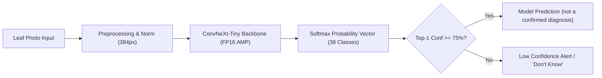

# AgriSmart AI — Smart Agricultural Diagnostics & Advisory System

> **SIH 2026 Submission** | Multiclass Crop Disease Detection & Precision Agriculture Advisory Platform

**Status:** The core teammate has added trained disease-model checkpoints, evaluation reports, and a standalone Streamlit console. Bonus modules A-D are integrated into the Flask API and interactive dashboard. The Flask disease endpoint, required `model/predict.py` interface, and bonus E remain explicit placeholders. Saved benchmark results below are reported by the project team, not independently reproduced during integration. A-D do not establish field suitability, optimal irrigation, or measured resource savings.

## 1. Modules Built (Core + Bonus)

Core experiments and the diagnostic console are in `notebooks/cv_model_notebooks/`; reusable A-D logic is in `services/`, HTTP integration in `app/routes/advisory.py`, and farmer-facing forms in `app/templates/` and `app/static/`.

- **Core Module — Computer Vision Plant Pathology Diagnostic Engine**:
  - High-precision classifier trained across **38 classes** (14 crop types, bacterial/fungal/viral diseases + healthy foliage).
  - State-of-the-art **ConvNeXt-Tiny (384px)** champion model achieving **0.9969 Macro-F1** and **99.85% Accuracy**.
  - A **0.75 confidence threshold** flags low-confidence inputs; high-confidence errors remain possible.
  - Interactive Streamlit Diagnostic Console. Flask disease inference integration is pending.
- **Bonus Module A — Precision Crop Recommendation Service**:
  - Experimental top-three dataset-label ranking based on seven source-scale soil/weather features; not proven farm suitability.
- **Bonus Module B — Smart Irrigation & Moisture Advisory**:
  - Evidence-aware calibrated root-zone soil-water balance, with irrigation action and volume calculations.
- **Bonus Module C — Dynamic Weather Advisory**:
  - Validated live Open-Meteo forecasts and transparent cold, heat, rain, wind, humidity, and moisture-check rules; explicit simulated demo mode.
- **Bonus Module D — Sustainability & Resource Optimization Score**:
  - Transparent water, electricity, and nitrogen intensity comparison with a yield-retention check; not a carbon audit or causal savings estimate.
- **Bonus Module E — Multilingual Farmer Assistant & Disease Explainer**:
  - Not implemented yet; endpoint returns HTTP 501.

### Bonus contribution in simple terms

| Module | Question it helps answer | Method used in the app |
| --- | --- | --- |
| A | Which three crop labels best match these experimental soil/weather values? | Trained random forest; not validated farm suitability |
| B | Does this assumed root-zone water balance suggest watering, and how much? | Transparent calculation, not the experimental irrigation ML model |
| C | What forecast conditions should I inspect or prepare for? | Weather-provider data and threshold rules |
| D | How do water, electricity, and nitrogen use compare with a baseline? | Published project formula with a yield-retention check |

The bonus contribution includes experiment notebooks, reusable services, numeric/unit checks, JSON API routes, an interactive dashboard, readable results, and non-training tests. Among bonus modules A-D, only A serves a trained ML model. See the [A-D demo and notebook guide](report/bonus_notebooks_guide.md) for a short walkthrough.

---

## 2. Quickstart & Setup

### Prerequisites

- Python 3.11 or later for the Flask A-D application.
- The core console additionally needs the core team's compatible PyTorch, torchvision, timm, Streamlit, and Pillow environment. These are not yet pinned in `requirements.txt`.
- CUDA-enabled GPU is optional for core inference.

### Installation & Run

```powershell
# 1. Clone repository & enter directory
git clone https://github.com/atharva557/AGRISMART_AI.git
cd AGRISMART_AI

# 2. (Optional) Create & activate virtual environment
python -m venv .venv
.\.venv\Scripts\Activate.ps1

# 3. Install Flask and bonus-serving dependencies
python -m pip install -r requirements.txt

# 4. Launch the A-D Flask application
python run.py
```

Copy `.env.example` to `.env` only on first setup; preserve existing local values and never commit real credentials. The crop artifact was saved with scikit-learn 1.9.1, so use the pinned serving requirements rather than a mismatched global installation.

For the separate disease diagnostic console, first configure the core team's inference dependencies and download its Git LFS checkpoints, then run:

```powershell
git lfs pull
streamlit run notebooks/cv_model_notebooks/testing.py
```

Access Flask at `http://127.0.0.1:5000` or Streamlit at `http://localhost:8501`. Core checkpoint downloads and console execution were not performed during the bonus merge.

---

## 3. Dataset & Source / License

| Dataset | Source & Provenance | License | Split (Train / Val) |
| :--- | :--- | :--- | :--- |
| **PlantVillage** *(Core Training & Validation)* | 54,305 curated color images across 38 crop pathology categories. | CC0 / Public Domain | **43,444 train (80%)** / **10,861 val (20%)** |
| **PlantDoc** *(In-the-Wild Generalization Test)* | Outdoor farm condition images with natural backgrounds, dirt, and varied lighting. | Open Research (MIT) | 34 held-out stress test samples |

---

## 4. Reported Metrics Across All Model Iterations

### Core Validation Metrics (PlantVillage Held-Out Validation — 10,861 Samples)

| Model Version | Backbone Architecture | Input Res | Macro-F1 (Primary) | Accuracy | Avg GPU Latency | Checkpoint |
| :--- | :--- | :--- | :--- | :--- | :--- | :--- |
| **v1 (Baseline)** | ResNet-18 | 224 × 224 | **0.9912** | 99.43% | 7.57 ms | [model_v1.pkl](notebooks/cv_model_notebooks/model_v1.pkl) |
| **v2 (Enhanced)** | ResNet-50 + Label Smooth | 224 × 224 | **0.9946** | 99.67% | **5.36 ms** | [model_v2.pkl](notebooks/cv_model_notebooks/model_v2.pkl) |
| **v3 (Champion)** | **ConvNeXt-Tiny (384px)** | **384 × 384** | **0.9969** | **99.85%** | 24.51 ms | [model_v3.pkl](notebooks/cv_model_notebooks/model_v3.pkl) |

Complete per-class results and core limitations are documented in [report/model_report.md](report/model_report.md). Saved A/B results and limitations are documented in the [A/B audit](report/bonus_ab_data_audit.md).

## Flask Endpoints and Bonus Integration

| Method | Route | Current behavior |
| --- | --- | --- |
| GET | `/` | Interactive A-D dashboard |
| GET | `/result` | Empty result template |
| GET | `/api/health` | JSON health status |
| POST | `/api/disease/predict` | 501, not implemented |
| POST | `/api/crops/recommend` | A: experimental top-three dataset-label ranking |
| POST | `/api/irrigation/advise` | B: soil-water-balance action and volume calculation |
| POST | `/api/weather/advise` | C: fresh forecast summary and threshold-based alerts |
| POST | `/api/sustainability/score` | D: simulated or measured-input resource comparison |
| POST | `/api/assistant/chat` | 501, not implemented |

The A-D endpoints require the versioned request envelope and explicit units/evidence described in [the shared input contract](docs/bonus_input_contract.md). They return `422` when data are missing, invalid, stale, or unsupported, and `503` when a required model/provider is unavailable. The disease endpoint should accept a validated multipart `image` upload when implemented. Do not commit or publicly serve user uploads.

---

The [A-D API guide](docs/bonus_input_contract.md) documents implemented inputs, outputs, units, errors, and cross-module boundaries, with planned checks labelled separately. [Example requests](docs/examples/bonus_contract_examples.json) include model-scale A, simulated B/C/D, and rejection cases; its planned acceptance cases are not claims of passing checks. The [A/B data audit](report/bonus_ab_data_audit.md) preserves saved benchmark results and field-input gaps.

Current validation is not field certification: unknown fields are ignored, supporting reference IDs are not authenticated, B does not enforce reading age or weather-period alignment, and D does not verify that measured production cycles have ended. C checks forecast acquisition age and coverage but uses generic thresholds, even when crop metadata are supplied. Keep demonstrations labelled experimental/simulated until these implementation and field-validation gaps are resolved.

## 5. Architecture Overview & Known Limitations



### Known Limitations & Honest Failure Modes

1. **Lab-to-Field Domain Gap:** Lab-trained models encounter accuracy drops on unsegmented in-field photos with soil, sky, or multiple leaves.
2. **Safety Mitigations:**
   - The core team's small external benchmark reports that the **0.75 confidence threshold** flags 44–58% of inputs. This is not a reliable out-of-distribution detector; wrong predictions can still exceed the threshold.
   - The report records ConvNeXt-Tiny top-1 accuracy of **32.4%** on 34 field-condition samples, versus 14.7% for ResNet-18. These small-sample results do not establish production field performance.

---

Keep local validation and official judging results distinct. Core notebooks/reports are available, but the required prediction interface and Flask disease route still need integration. Saved bonus benchmark results are summarized in the A/B audit. Preserve source/license attribution and do not commit external datasets or private field records.

## Checks and submission

With the Python environment active:

```sh
python -m unittest discover -s tests -v
```

The current suite contains 12 tests covering the Flask shell, A model inference, B and D formulas, C rule evaluation with deterministic provider data, and selected A-D failure states. They do not execute notebook cells, retrain models, authenticate field evidence, or independently reproduce saved benchmark metrics. A real `tests/sample_leaf.jpg` can be added locally from permitted data; none is bundled. See [tests/README.md](tests/README.md) for fixture requirements.

## Irrigation notebook

`notebooks/07_irrigation_baseline.ipynb` contains an offline, rule-based irrigation prototype with assumed crop-stage profiles, simulated soil/weather inputs, decision explanations, a comparison chart, and sanity checks. It does not train a model or demonstrate real water savings. The Flask service now implements a stricter calibrated soil-water-balance path and labels assumed inputs as simulation.

Install the separate notebook dependencies and open JupyterLab from the repository root:

```powershell
.\.venv\Scripts\python.exe -m pip install -r requirements-notebooks.txt
.\.venv\Scripts\python.exe -m jupyterlab notebooks/07_irrigation_baseline.ipynb
```

On macOS/Linux, use `python` with the virtual environment activated. In JupyterLab or VS Code, select the project's Python environment and run all cells. Edit the final example to try another simulated farm. Source references and validation limitations are included in the notebook.

## Train an irrigation model

`notebooks/08_irrigation_model_training.ipynb` is the supervised training notebook for the user to run. It uses [Mendeley field data, version 3](https://data.mendeley.com/datasets/cjb4vy4mzj/3) to predict an observed irrigation start within the next hour when the valve is currently closed. It learns one field's controller behavior, not universally optimal irrigation needs.

1. Install `requirements-notebooks.txt` using the project's Python environment.
2. Open notebook 08 and run the cells yourself. The loader tries the official file downloads.
3. If downloads are blocked, use the source page to download `D_moisture.txt` and `D_valve.txt` into `data/irrigation/raw/`, then rerun the loader. Preserve the original file bytes so the published checksums match.
4. Review the chronological split, train the models, and inspect the validation comparison before final test evaluation.
5. The final cell saves a model under `model/weights/irrigation/` and metrics/figures under `outputs/`.

The notebook compares majority and single-moisture-split baselines with logistic regression and random forest. Model and decision-threshold selection use validation data only. The user's saved run selected random forest; its test results and limitations are in the [A/B audit](report/bonus_ab_data_audit.md). No training or notebook-cell execution was performed while preparing notebook 08 or auditing its saved results.

See [dataset selection and limitations](report/irrigation_data_selection.md) and the [source-file manifest](report/irrigation_dataset_manifest.json). The saved classifier remains a controller-behavior benchmark; the Flask farm-advisory path deliberately uses the transparent water balance instead.

## Bonus notebooks: A, C, D

Use the same `requirements-notebooks.txt` environment and run the notebooks yourself:

| Module | Notebook | What it prepares |
| --- | --- | --- |
| A — Crop recommendation | [09_crop_recommendation_training.ipynb](notebooks/09_crop_recommendation_training.ipynb) | Source validation, four classifier baselines, validation selection, held-out evaluation, top-three candidates, model export |
| C — Weather advisory | [10_weather_advisory.ipynb](notebooks/10_weather_advisory.ipynb) | Open-Meteo forecasts, configurable alert rules, explicit offline demo, timestamps, units, caching, plots |
| D — Sustainability | [11_sustainability_scoring.ipynb](notebooks/11_sustainability_scoring.ipynb) | Transparent resource-use formula, comparable baseline inputs, yield check, simulated scenarios, report export |

Notebook 09 uses a verified 2,200-row crop dataset. Its nutrient scales and rainfall aggregation period need validation before real farm inputs or weather integration. Notebook 10 defaults to live forecasts for editable Pune coordinates; select `MODE = "demo"` for offline simulated inputs. Notebook 11 uses simulated records by default; its custom score does not establish measured savings. Only notebook 09 trains a model.

The user has executed these notebooks and produced local artifacts. The evaluated A serving model, its training report, validation comparison, and confusion matrix are deliberately packaged so a clean checkout can run A; other generated artifacts remain ignored. Reusable A-D logic is connected to the Flask endpoints, and the API preserves the notebook limitations and data-kind labels. See the [bonus notebook guide](report/bonus_notebooks_guide.md) and [source manifest](report/bonus_modules_sources.json) for details.

Before submission, connect the disease model to the required prediction interface and Flask route, finalize a reproducible core dependency setup, verify a clean checkout can reproduce core and bonus predictions, and add the 3–5 minute demo video and deployment link. Follow the brief's 10–15 September work window and preserve authentic development history.

## 6. Project Links & Deliverables

- **Core Model Report:** [report/model_report.md](report/model_report.md)
- **Streamlit Evaluation Console:** [testing.py](notebooks/cv_model_notebooks/testing.py)
- **Bonus Notebook Guide:** [report/bonus_notebooks_guide.md](report/bonus_notebooks_guide.md)
- **Demo Video:** `[Pending / Add Demo Link Here]`
- **Live Deployed App:** `[Pending / Add Deployment URL Here]`
