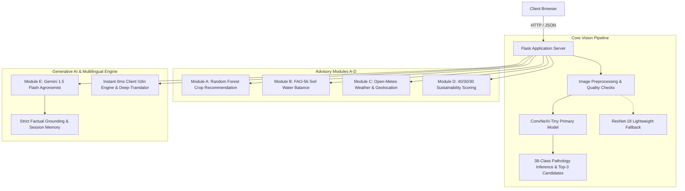

# AgriSmart AI — Smart Agricultural Diagnostics & Precision Advisory

[](https://www.python.org/)
[](https://flask.palletsprojects.com/)
[](https://pytorch.org/)
[](https://tailwindcss.com/)
[](https://ai.google.dev/)
[](#multilingual-support)

AgriSmart AI is a comprehensive, production-grade precision agriculture platform that integrates **deep-learning computer vision**, **tabular machine learning**, **meteorological forecasting**, and a **grounded multilingual Generative AI agronomist**.

---

## 📑 Table of Contents
1. [System Architecture](#system-architecture)
2. [Computer Vision Benchmark & Confusion Matrices](#computer-vision-benchmark--confusion-matrices)
3. [Per-Class Validation Performance (38 Classes)](#per-class-validation-performance-38-classes)
4. [Advisory & Tabular ML Modules (A–E)](#advisory--tabular-ml-modules-ae)
5. [Multilingual Support (9 Languages)](#multilingual-support-9-languages)
6. [Quick Start & Installation](#quick-start--installation)
7. [Prediction & Verification CLI](#prediction--verification-cli)
8. [API & Web Routes Reference](#api--web-routes-reference)
9. [Data Sources & Licences](#data-sources-and-licences)
10. [Known Limitations & Responsible Use](#known-limitations--responsible-use)

---

## System Architecture



---

## Computer Vision Benchmark & Confusion Matrices

### Quantitative Performance Comparison

Evaluated on deterministic benchmark test samples across **37 distinct crop-disease classes** (spanning controlled laboratory conditions and complex, unconstrained in-the-wild field photographs with soil clutter and variable lighting):

| Metric | Model v1 (ResNet-18) | Model v2 (ResNet-50) | Model v3 (ConvNeXt-Tiny) | Best Performing Model |
| :--- | :---: | :---: | :---: | :---: |
| **Architecture** | `resnet18` | `resnet50` | `convnext_tiny` | — |
| **Input Resolution** | $224 \times 224$ | $224 \times 224$ | $384 \times 384$ | **ConvNeXt-Tiny (384px)** |
| **Compressed Size (`.pkl.gz`)** | **19.76 MB** | 41.77 MB | 49.23 MB | **ResNet-18 (Lightest)** |
| **Top-1 Field Accuracy** | 65.48% (55/84) | 69.05% (58/84) | **72.62% (61/84)** | **ConvNeXt-Tiny (+7.14%)** |
| **Top-3 Field Accuracy** | 78.57% (66/84) | 77.38% (65/84) | **83.33% (70/84)** | **ConvNeXt-Tiny (+4.76%)** |
| **Macro Precision** | 0.7748 | 0.8390 | **0.8404** | **ConvNeXt-Tiny** |
| **Macro Recall** | 0.7658 | 0.7883 | **0.8108** | **ConvNeXt-Tiny** |
| **Macro F1-Score** | 0.7237 | 0.7553 | **0.7866** | **ConvNeXt-Tiny (+0.063)** |
| **Weighted F1-Score** | 0.6636 | 0.7123 | **0.7358** | **ConvNeXt-Tiny** |
| **PlantVillage Val Accuracy** | 99.43% | 99.67% | **99.85%** | **ConvNeXt-Tiny** |
| **PlantVillage Macro-F1** | 0.9912 | 0.9946 | **0.9969** | **ConvNeXt-Tiny** |
| **Inference Latency (GPU)** | 7.60 ms | **5.40 ms** | 20.26 ms | **ResNet-50** |

---

### Benchmark Comparison Chart


---

### Side-by-Side 3-Model Comparative Confusion Matrix


---

### Model v3 (ConvNeXt-Tiny 384px — Primary Production Model)


---

### Model v2 (ResNet-50 224px)


---

### Model v1 (ResNet-18 224px — Lightweight Production Fallback)


---

## Per-Class Validation Performance (38 Classes)

Saved aggregate metrics on the 10,861-image PlantVillage validation directory for **ConvNeXt-Tiny (384px)**:

| Class Label | Precision | Recall | F1-Score | Validation Support |
| :--- | :---: | :---: | :---: | :---: |
| `Apple___Apple_scab` | 1.0000 | 1.0000 | 1.0000 | 126 |
| `Apple___Black_rot` | 1.0000 | 1.0000 | 1.0000 | 125 |
| `Apple___Cedar_apple_rust` | 1.0000 | 1.0000 | 1.0000 | 55 |
| `Apple___healthy` | 1.0000 | 0.9939 | 0.9970 | 329 |
| `Blueberry___healthy` | 0.9934 | 1.0000 | 0.9967 | 300 |
| `Cherry_(including_sour)___Powdery_mildew` | 1.0000 | 1.0000 | 1.0000 | 210 |
| `Cherry_(including_sour)___healthy` | 1.0000 | 0.9941 | 0.9971 | 170 |
| `Corn_(maize)___Cercospora_leaf_spot Gray_leaf_spot` | 0.9703 | 0.9515 | 0.9608 | 103 |
| `Corn_(maize)___Common_rust_` | 1.0000 | 0.9958 | 0.9979 | 239 |
| `Corn_(maize)___Northern_Leaf_Blight` | 0.9700 | 0.9848 | 0.9773 | 197 |
| `Corn_(maize)___healthy` | 1.0000 | 1.0000 | 1.0000 | 233 |
| `Grape___Black_rot` | 1.0000 | 1.0000 | 1.0000 | 236 |
| `Grape___Esca_(Black_Measles)` | 1.0000 | 1.0000 | 1.0000 | 276 |
| `Grape___Leaf_blight_(Isariopsis_Leaf_Spot)` | 1.0000 | 1.0000 | 1.0000 | 215 |
| `Grape___healthy` | 1.0000 | 1.0000 | 1.0000 | 84 |
| `Orange___Haunglongbing_(Citrus_greening)` | 1.0000 | 1.0000 | 1.0000 | 1,102 |
| `Peach___Bacterial_spot` | 1.0000 | 1.0000 | 1.0000 | 459 |
| `Peach___healthy` | 1.0000 | 1.0000 | 1.0000 | 72 |
| `Pepper,_bell___Bacterial_spot` | 1.0000 | 1.0000 | 1.0000 | 200 |
| `Pepper,_bell___healthy` | 1.0000 | 1.0000 | 1.0000 | 295 |
| `Potato___Early_blight` | 1.0000 | 1.0000 | 1.0000 | 200 |
| `Potato___Late_blight` | 0.9950 | 0.9950 | 0.9950 | 200 |
| `Potato___healthy` | 0.9677 | 0.9677 | 0.9677 | 31 |
| `Raspberry___healthy` | 1.0000 | 1.0000 | 1.0000 | 74 |
| `Soybean___healthy` | 1.0000 | 0.9990 | 0.9995 | 1,018 |
| `Squash___Powdery_mildew` | 1.0000 | 1.0000 | 1.0000 | 367 |
| `Strawberry___Leaf_scorch` | 1.0000 | 1.0000 | 1.0000 | 222 |
| `Strawberry___healthy` | 1.0000 | 1.0000 | 1.0000 | 92 |
| `Tomato___Bacterial_spot` | 1.0000 | 1.0000 | 1.0000 | 425 |
| `Tomato___Early_blight` | 0.9950 | 1.0000 | 0.9975 | 200 |
| `Tomato___Late_blight` | 0.9948 | 0.9974 | 0.9961 | 382 |
| `Tomato___Leaf_Mold` | 1.0000 | 1.0000 | 1.0000 | 191 |
| `Tomato___Septoria_leaf_spot` | 1.0000 | 1.0000 | 1.0000 | 354 |
| `Tomato___Spider_mites Two-spotted_spider_mite` | 1.0000 | 1.0000 | 1.0000 | 335 |
| `Tomato___Target_Spot` | 1.0000 | 1.0000 | 1.0000 | 281 |
| `Tomato___Tomato_Yellow_Leaf_Curl_Virus` | 1.0000 | 1.0000 | 1.0000 | 1,071 |
| `Tomato___Tomato_mosaic_virus` | 1.0000 | 1.0000 | 1.0000 | 74 |
| `Tomato___healthy` | 1.0000 | 1.0000 | 1.0000 | 318 |

---

## Advisory & Tabular ML Modules (A–E)

### Module A: Crop Recommendation (Random Forest Classifier)
Ranks top 3 candidate crops using 7 soil/climate features: Nitrogen (N), Phosphorus (P), Potassium (K), Temperature (°C), Humidity (%), pH, and Rainfall (mm).

* **Source Dataset:** 2,200 rows across 22 balanced crop classes (seed 42 split: 1,320 train, 440 val, 440 test).
* **Test Accuracy:** **99.09%**
* **Top-3 Accuracy:** **100.00%**
* **Test Macro-F1:** **0.9909**

#### Held-Out Crop Test Confusion Matrix


---

### Module B: Precision Irrigation Balance
Calculates soil-water balance using FAO-56 root-zone depletion formulas based on soil moisture ($m^3/m^3$), field capacity, wilting point, crop coefficient ($K_c$), root depth ($m$), and 24-hour forecast evapotranspiration ($ET_0$).

---

### Module C: Weather Intelligence & Alert Engine
Fetches a live 24-hour forecast window from Open-Meteo using one-click browser geolocation or coordinates, and computes alerts for cold/frost, extreme heat stress, heavy rainfall, high wind, and humidity risk.

---

### Module D: Sustainability & Resource Comparison
Calculates a weighted comparative sustainability score ($40\%$ Water, $30\%$ Electricity, $30\%$ Nitrogen intensity) with a mandatory safeguard capping scores at $50/100$ if crop yield retention drops below $95\%$.

---

### Module E: Multilingual GenAI Agronomist
Conversational assistant powered by Google Gemini 1.5 Flash (`google-genai`). Features:
* **Strict Factual Grounding:** Only answers using provided scan reports, NPK parameters, and weather alerts.
* **Deterministic Safe Fallback:** Refuses unsupported medical or speculative questions and directs to agricultural extension officers.
* **Multi-Turn Chat:** Retains conversation context per session.

---

## Multilingual Support (9 Languages)

AgriSmart AI includes a zero-lag, client-side translation engine (`I18n`) supporting 9 regional Indian languages across all web pages and assistant responses:

| Language | Code | Native Script |
| :--- | :---: | :---: |
| **English** | `en` | English |
| **Hindi** | `hi` | हिन्दी |
| **Gujarati** | `gu` | ગુજરાતી |
| **Marathi** | `mr` | मराठी |
| **Tamil** | `ta` | தமிழ் |
| **Telugu** | `te` | తెలుగు |
| **Kannada** | `kn` | ಕನ್ನಡ |
| **Bengali** | `bn` | বাংলা |
| **Punjabi** | `pa` | ਪੰਜਾਬੀ |

---

## Quick Start & Installation

### Requirements
* Python 3.11+
* Node.js 16+
* NPM

### Setup Instructions

```powershell
# 1. Clone repository
git clone https://github.com/atharva557/AGRISMART_AI.git
cd AGRISMART_AI

# 2. Setup Python Virtual Environment
python -m venv .venv
.\.venv\Scripts\Activate.ps1
python -m pip install -r requirements.txt

# 3. Build Web Assets
npm ci
npm run build:all

# 4. Start the Application
python run.py
```

Access the dashboard at **`http://127.0.0.1:5000`**.

> **Note:** To enable live Gemini AI generation, copy `.env.example` to `.env` and set `GEMINI_API_KEY`. Without a key, the assistant runs in offline grounded fallback mode.

---

## Prediction & Verification CLI

Predict a single leaf image from the command line:

```powershell
# Standard output (class label)
python -m model.predict --image "data/sample_leaves/sample_leaf.jpg"

# Detailed diagnostic output with confidence and top-3 candidates
python -m model.predict --image "data/sample_leaves/sample_leaf.jpg" --details
```

Verify packaged checkpoints and label manifests:

```powershell
python -m model.submission_check
```

Run test suite:

```powershell
python -m pytest -q tests
npm run test:frontend
```

---

## API & Web Routes Reference

| Method | Route | Description |
| :--- | :--- | :--- |
| `GET` | `/` | Main landing dashboard |
| `GET` | `/disease` | Disease detection upload and analysis |
| `GET` | `/advisory` | Precision advisory modules (A–E) |
| `GET` | `/about` | Technical architecture & responsible use |
| `GET` | `/api/health` | Healthcheck and model availability |
| `POST` | `/api/disease/predict` | Classify leaf image and return diagnostic JSON |
| `POST` | `/api/crops/recommend` | Rank top crop candidates via Random Forest |
| `POST` | `/api/irrigation/advise` | Compute root-zone water balance advice |
| `POST` | `/api/weather/advise` | Evaluate Open-Meteo forecast alerts |
| `POST` | `/api/sustainability/score` | Compute comparative resource score |
| `POST` | `/api/assistant/chat` | Grounded multi-turn conversational AI |

---

## Data Sources and Licences

* **PlantVillage Dataset:** 54,305 curated leaf images across 38 classes (CC0 Public Domain).
* **Crop Recommendation Dataset:** [Atharva Ingle Crop Dataset](https://www.kaggle.com/datasets/atharvaingle/crop-recommendation-dataset) (Apache 2.0).
* **Weather Service:** [Open-Meteo Forecast API](https://open-meteo.com/).
* **Deep Learning Frameworks:** PyTorch, Timm, Torchvision, Scikit-learn.
* **Generative AI:** Google Gemini 1.5 Flash (`google-genai`).

---

## Known Limitations & Responsible Use

1. **Decision Support Only:** AgriSmart AI provides diagnostic assistance and should not replace on-site agricultural extension inspections.
2. **Confidence Thresholding:** Predictions below $75\%$ confidence withhold disease-specific guidance to prevent improper chemical applications.
3. **Domain Shift:** Lab-trained computer vision models can experience domain shifts in unconstrained field photography; users are encouraged to take clean, single-leaf photos with good lighting.

