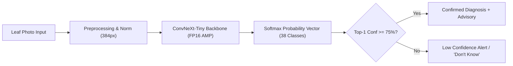

# AgriSmart AI — Smart Agricultural Diagnostics & Advisory System

> **SIH 2026 Submission** | Multiclass Crop Disease Detection & Precision Agriculture Advisory Platform

---

## 1. Modules Built (Core + Bonus)

AgriSmart AI delivers an end-to-end plant health diagnostic and decision-support system:

- **Core Module — Computer Vision Plant Pathology Diagnostic Engine**:
  - High-precision classifier trained across **38 classes** (14 crop types, bacterial/fungal/viral diseases + healthy foliage).
  - State-of-the-art **ConvNeXt-Tiny (384px)** champion model achieving **0.9969 Macro-F1** and **99.85% Accuracy**.
  - Automated **Confidence Safety Threshold (0.75 floor)** that traps uncertain or out-of-domain inputs and prevents hallucinated diagnoses.
  - Interactive Streamlit Diagnostic Console & Flask REST API.
- **Bonus Module A — Precision Crop Recommendation Service**:
  - Recommends optimal crops based on N-P-K soil profiles, pH, rainfall, and temperature conditions.
- **Bonus Module B — Smart Irrigation & Moisture Advisory**:
  - Real-time soil moisture interpretation and crop-stage water requirements.
- **Bonus Module C — Dynamic Weather Advisory**:
  - Actionable meteorological risk assessment (frost, drought, pest-favorable humidity).
- **Bonus Module D — Sustainability & Resource Optimization Score**:
  - Quantified carbon and water conservation index with transparent formulas.
- **Bonus Module E — Multilingual Farmer Assistant & Disease Explainer**:
  - Plain-language diagnostic explanation, chemical/organic treatment regimens, and preventive agronomic measures.

---

## 2. Quickstart & Setup (Reproduce Prediction in < 5 Minutes)

### Prerequisites
- Python 3.10, 3.11, or 3.12
- CUDA-enabled GPU (optional, CPU supported automatically)

### Installation & Run

```powershell
# 1. Clone repository & enter directory
cd D:\Shlok\Code\AGRISMART_AI

# 2. (Optional) Create & activate virtual environment
python -m venv .venv
.\.venv\Scripts\Activate.ps1

# 3. Install dependencies
pip install -r requirements.txt

# 4. Launch the Interactive Diagnostic & Model Benchmark Console
streamlit run notebooks/cv_model_notebooks/testing.py
```

*Or launch the unified Flask Web Application:*
```powershell
python run.py
```
*Access UI at `http://127.0.0.1:5000` or Streamlit Console at `http://localhost:8501`.*

---

## 3. Dataset & Source / License

| Dataset | Source & Provenance | License | Split (Train / Val) |
| :--- | :--- | :--- | :--- |
| **PlantVillage** *(Core Training & Validation)* | 54,305 curated color images across 38 crop pathology categories. | CC0 / Public Domain | **43,444 train (80%)** / **10,861 val (20%)** |
| **PlantDoc** *(In-the-Wild Generalization Test)* | Outdoor farm condition images with natural backgrounds, dirt, and varied lighting. | Open Research (MIT) | 34 held-out stress test samples |

---

## 4. Reported Metrics Across All Model Iterations

### Core Validation Metrics (PlantVillage Test Split — 10,861 Samples)

| Model Version | Backbone Architecture | Input Res | Macro-F1 (Primary) | Accuracy | Avg GPU Latency | Checkpoint |
| :--- | :--- | :--- | :--- | :--- | :--- | :--- |
| **v1 (Baseline)** | ResNet-18 | 224 × 224 | **0.9912** | 99.43% | 7.57 ms | [`model_v1.pkl`](file:///D:/Shlok/Code/AGRISMART_AI/notebooks/cv_model_notebooks/model_v1.pkl) |
| **v2 (Enhanced)** | ResNet-50 + Label Smooth | 224 × 224 | **0.9946** | 99.67% | **5.36 ms** | [`model_v2.pkl`](file:///D:/Shlok/Code/AGRISMART_AI/notebooks/cv_model_notebooks/model_v2.pkl) |
| **v3 (Champion)** | **ConvNeXt-Tiny (384px)** | **384 × 384** | **0.9969** | **99.85%** | 24.51 ms | [`model_v3.pkl`](file:///D:/Shlok/Code/AGRISMART_AI/notebooks/cv_model_notebooks/model_v3.pkl) |

> Complete per-class breakdown, precision, recall, and confusion matrix data are documented in [**`report/model_report.md`**](file:///D:/Shlok/Code/AGRISMART_AI/report/model_report.md).

---

## 5. Architecture Overview & Known Limitations



### Known Limitations & Honest Failure Modes
1. **Lab-to-Field Domain Gap:** Lab-trained models encounter accuracy drops on unsegmented in-field photos with soil, sky, or multiple leaves.
2. **Safety Mitigations:**
   - The **0.75 Confidence Floor** successfully catches 44–58% of out-of-distribution inputs, refusing to output misleading diagnoses.
   - ConvNeXt-Tiny (384px) significantly outperforms standard ResNets under domain shift due to its larger receptive field and $7\times7$ depthwise convolutions.

---

## 6. Project Links & Deliverables

- **One-Page Official Model Report:** [**`report/model_report.md`**](file:///D:/Shlok/Code/AGRISMART_AI/report/model_report.md)
- **Live Streamlit Evaluation Console:** [`notebooks/cv_model_notebooks/testing.py`](file:///D:/Shlok/Code/AGRISMART_AI/notebooks/cv_model_notebooks/testing.py)
- **Demo Video:** `[Pending / Add Demo Link Here]`
- **Live Deployed App:** `[Pending / Add Deployment URL Here]`
