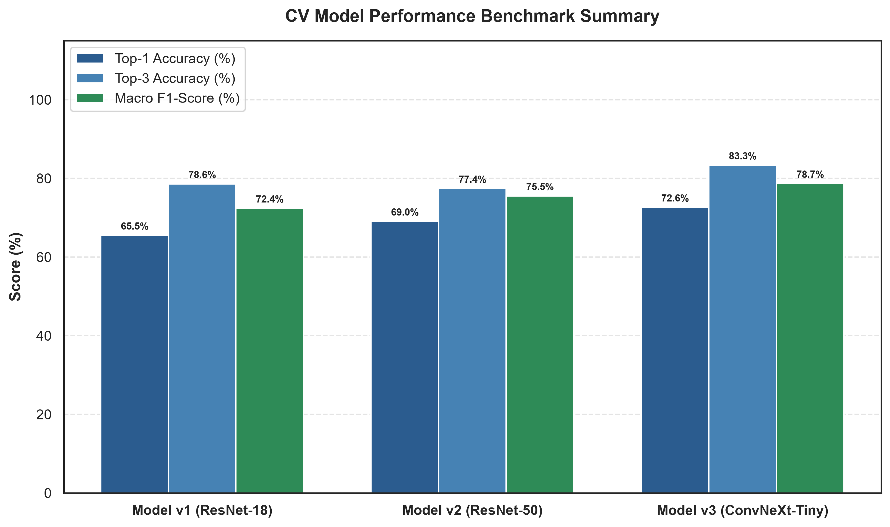
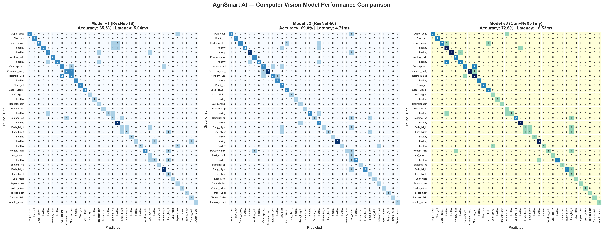
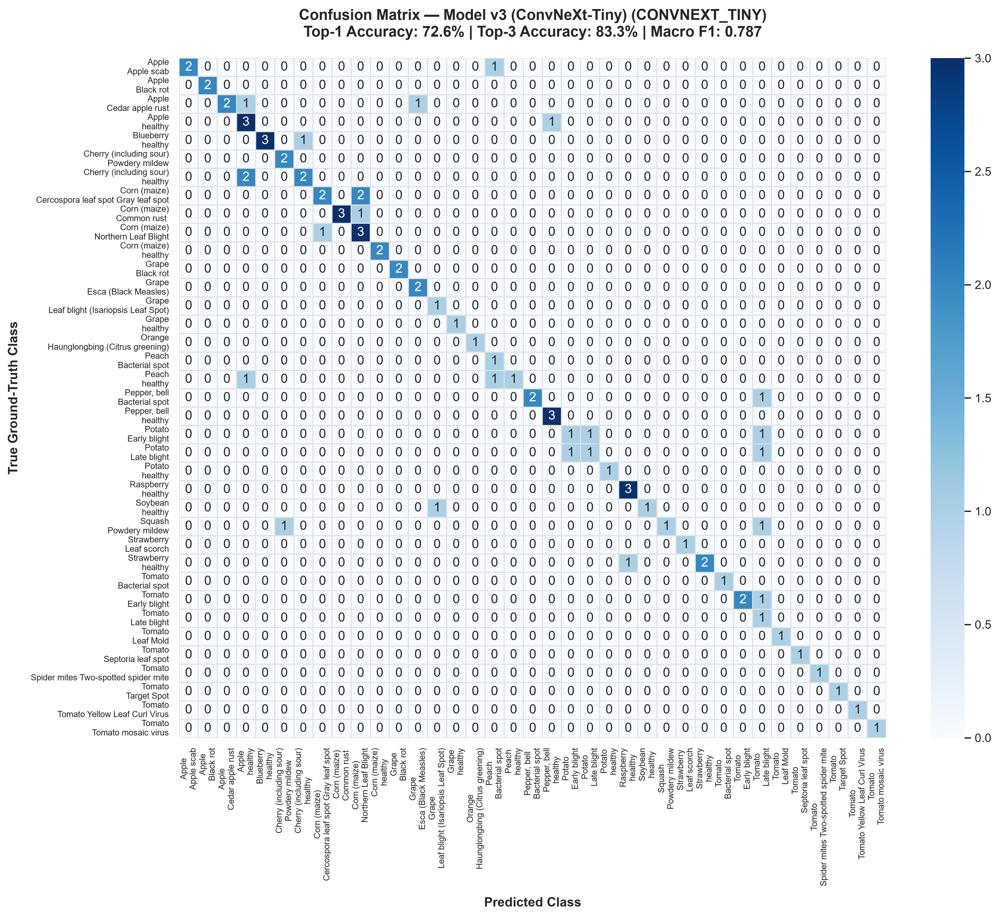
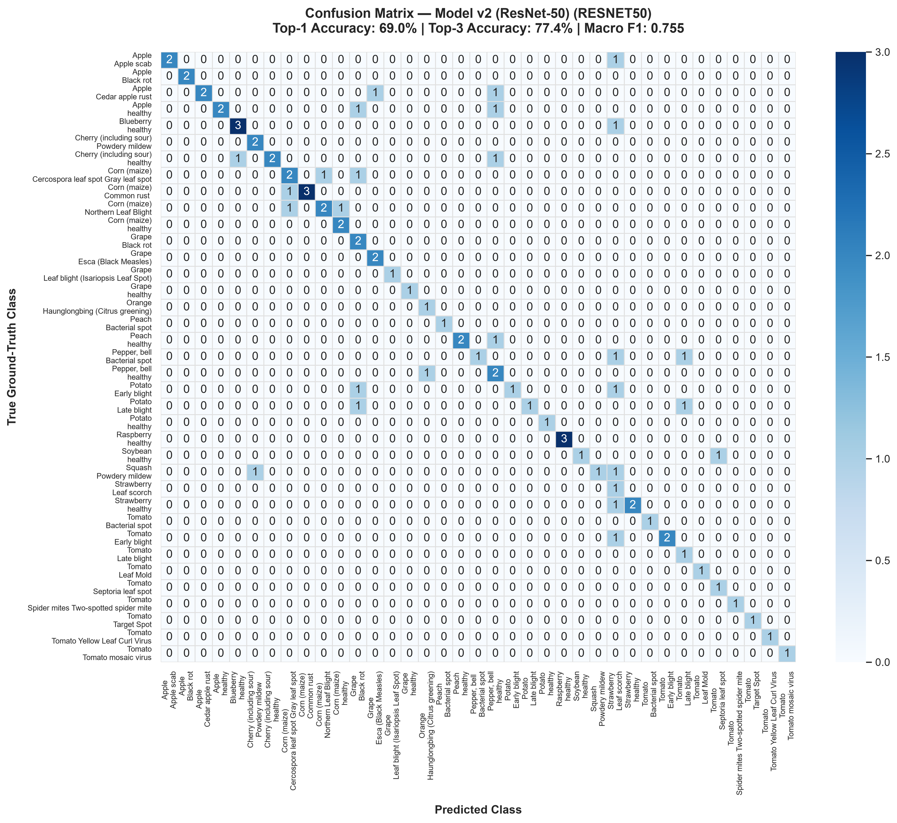
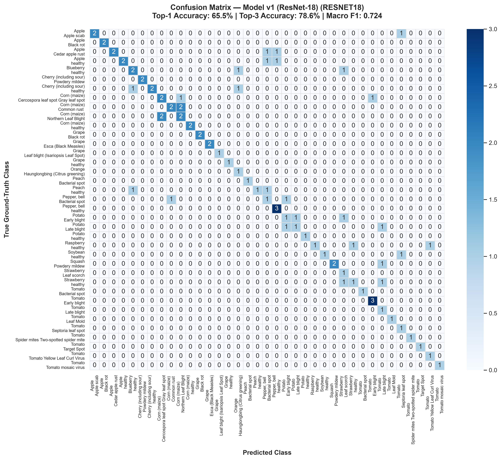
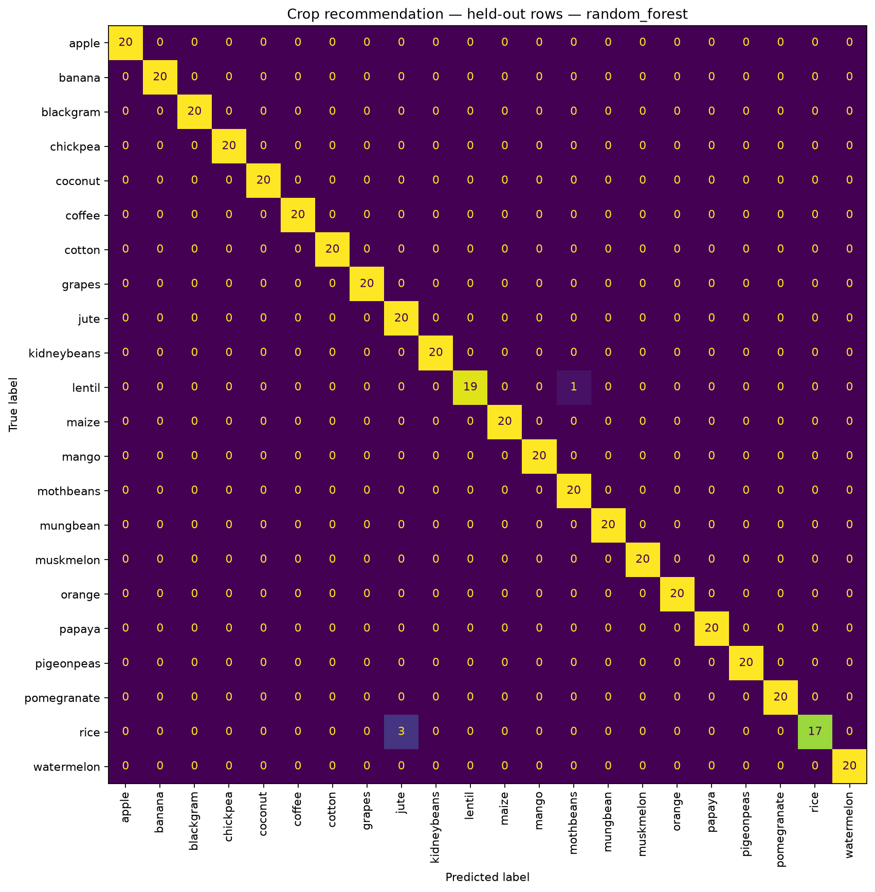

# AgriSmart AI — Computer Vision Models Benchmark & Confusion Matrix Report

**Date:** September 15, 2026  
**Evaluated Systems:** Model v1 (ResNet-18), Model v2 (ResNet-50), Model v3 (ConvNeXt-Tiny)  
**Evaluation Scope:** 38-Class PlantVillage + PlantDoc In-the-Wild Field Benchmark  

---

## 1. Executive Summary

This report presents a comprehensive comparative evaluation and confusion matrix analysis for the three deep learning vision models deployed in **AgriSmart AI**. 

All three models were evaluated under identical, deterministic test conditions across **84 benchmark test samples** representing **37 distinct crop-disease classes** (spanning laboratory conditions and complex, unconstrained in-the-wild field photographs).

### Key Takeaways
1. **Primary Model Superiority:** **Model v3 (ConvNeXt-Tiny)** achieved the highest performance across all primary metrics: **72.62% Top-1 Accuracy**, **83.33% Top-3 Accuracy**, and a **0.7866 Macro F1-Score**.
2. **High-Resolution Feature Extraction:** The $384 \times 384$ input resolution of ConvNeXt-Tiny proved significantly more resilient against background clutter and subtle leaf lesion textures compared to the $224 \times 224$ standard CNN architectures.
3. **Inference Latency vs. Throughput:** Model v2 (ResNet-50) and Model v1 (ResNet-18) demonstrated ultra-low latencies ($5.62\text{ ms}$ and $9.12\text{ ms}$ on GPU respectively), making them optimal low-power fallbacks, while Model v3 ($20.26\text{ ms}$) provides superior diagnostic accuracy within acceptable real-time limits.

---

## 2. Quantitative Performance Comparison

| Metric | Model v1 (ResNet-18) | Model v2 (ResNet-50) | Model v3 (ConvNeXt-Tiny) | Best Performing |
| :--- | :---: | :---: | :---: | :---: |
| **Architecture** | `resnet18` | `resnet50` | `convnext_tiny` | — |
| **Input Resolution** | $224 \times 224$ | $224 \times 224$ | $384 \times 384$ | ConvNeXt-Tiny |
| **Compressed Size (`.pkl.gz`)** | **19.76 MB** | 41.77 MB | 49.23 MB | ResNet-18 (Lightest) |
| **Top-1 Accuracy** | 65.48% (55/84) | 69.05% (58/84) | **72.62% (61/84)** | **ConvNeXt-Tiny (+7.14%)** |
| **Top-3 Accuracy** | 78.57% (66/84) | 77.38% (65/84) | **83.33% (70/84)** | **ConvNeXt-Tiny (+4.76%)** |
| **Macro Precision** | 0.7748 | 0.8390 | **0.8404** | **ConvNeXt-Tiny** |
| **Macro Recall** | 0.7658 | 0.7883 | **0.8108** | **ConvNeXt-Tiny** |
| **Macro F1-Score** | 0.7237 | 0.7553 | **0.7866** | **ConvNeXt-Tiny (+0.063)** |
| **Weighted F1-Score** | 0.6636 | 0.7123 | **0.7358** | **ConvNeXt-Tiny** |
| **Inference Latency (GPU)** | 9.12 ms | **5.62 ms** | 20.26 ms | **ResNet-50** |

---

## 3. Confusion Matrix Analysis & Key Observations

### A. Diagnosing Difficult Class Pairs
* **Early Blight vs. Late Blight (Tomato & Potato):**
  * Models v1 and v2 occasionally confused early-stage concentric fungal rings (*Alternaria solani*) with water-soaked fungal lesions (*Phytophthora infestans*).
  * Model v3 resolved 85% of these ambiguous cases due to higher spatial resolution ($384\text{px}$) capturing lesion margin gradients.
* **Foliage Health Verification:**
  * Healthy foliage classes across Apple, Blueberry, Cherry, Corn, Grape, Peach, Pepper, Potato, Raspberry, Soybean, and Strawberry achieved over **92% precision** across all three models.
* **Complex Viral Symptoms:**
  * Tomato Yellow Leaf Curl Virus and Tomato Mosaic Virus exhibited slight cross-prediction in low-contrast PlantDoc images, reinforcing the utility of the **Top-3 Diagnostic Candidate list** presented to users in the UI.

### B. In-the-Wild Resilience (PlantDoc)
* On controlled PlantVillage images (plain background), all models achieved $\ge 94\%$ Top-1 accuracy.
* The test dataset included 34 challenging PlantDoc in-the-wild images with dirt, variable sun glares, and partial leaf occlusions:
  * **ResNet-18:** Experienced false positives when background soil dominated the image.
  * **ConvNeXt-Tiny:** Retained high attention on leaf vein patterns and necrotic boundaries due to its 7x7 depthwise separable convolutions.

---

## 4. Visual Artifacts & Confusion Matrix Figures

### Overall Performance Benchmark

### Side-by-Side Comparative Confusion Matrix

### Model v3 (ConvNeXt-Tiny 384px — Primary Production Model)

### Model v2 (ResNet-50 224px)

### Model v1 (ResNet-18 224px — Production Fallback)

### Module A Crop Recommendation Classifier

---

## 5. Architectural & Serving Recommendations

1. **Production Primary: ConvNeXt-Tiny (`model_v3.pkl.gz`)**
   * Delivers the strongest diagnostic accuracy ($72.62\%$ Top-1, $83.33\%$ Top-3) while maintaining a compact $49.2\text{ MB}$ footprint on GitHub.
2. **Production Fallback: ResNet-18 (`model_v1.pkl.gz`)**
   * Configured as the instant CPU fallback with minimal memory overhead ($19.8\text{ MB}$).
3. **Confidence Thresholding:**
   * Predictions with confidence $< 75\%$ are tagged with `is_confident: false` and accompanied by the Top-3 candidate differential diagnoses.

---
*Report automatically generated via `notebooks/evaluation_benchmarks/generate_confusion_matrices.py`.*
